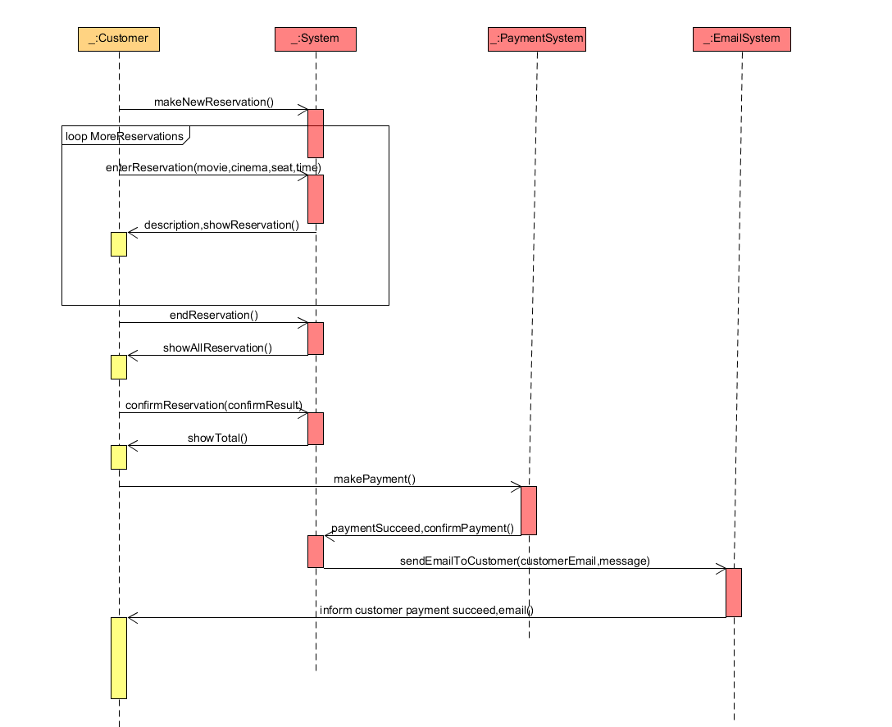
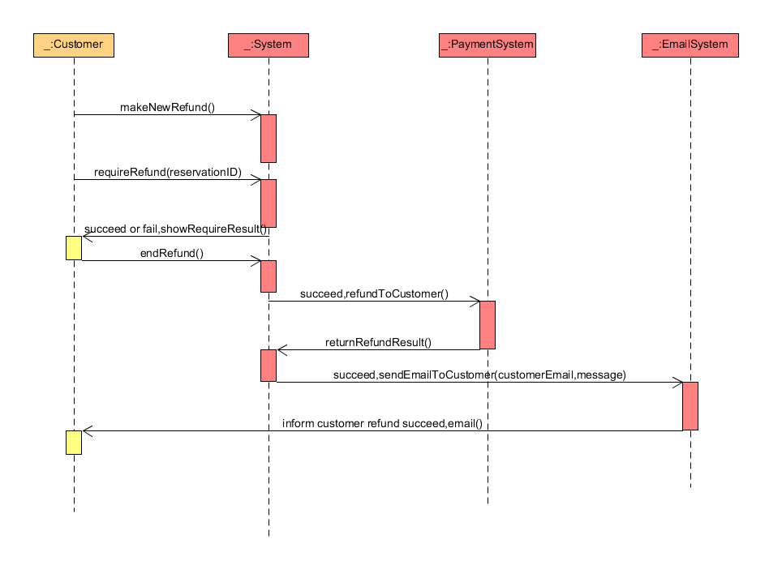
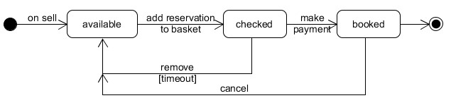
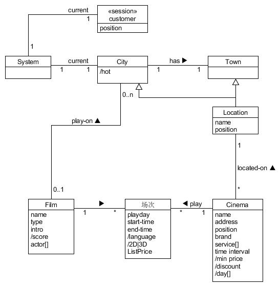
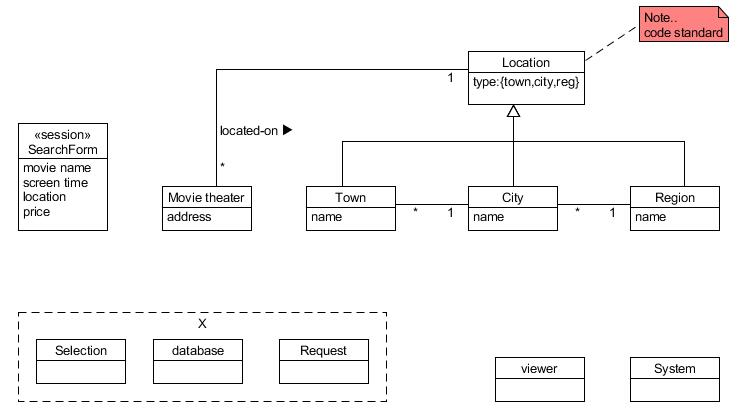
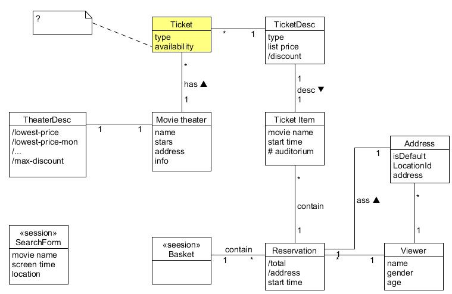

# 软件需求文档
## 1. 引言

### 1.1 目的

 编写此文档的目的是进一步定制软件开发的细节问题,希望能使本软件开发工作更具体。 是为使用户、软件开发者及分
析人员对该软件的初始规定有一个共同的理解，它说明了本产品的各项功能需求、性能需求和数据要求，明确标识各功
能的实现过程，阐述实用背景及范围，提供客户解决问题或达到目标所需的条件或权能，提供一个度量和遵循的基准

### 1.2 项目背景

随着电影行业经济的快速增长，各大在线购票电商平台也百家争鸣，互相竞争电影市场。电影购票代理网站的核心是购票，
但是当下电影产业发展使得购票绝不会成为一个与电影相关的网站的主要竞争力。因而关于构建新一代电影购票网站的理
念也就应运而生

### 1.3 定义

 文档中采用的专门术语的定义及缩略词简要如下: 
 CINEMA  TICKET  SYSTEM  影院售票系统

### 1.4 参考资料

[1]潘茂林 《分布式计算课程内容》《系统设计分析与设计课程内容》

## 2. 任务概述

### 2.1 目标

项目需求细化

实现网站首页： 实现“正在热映”、“即将上映”的电影列表模块、搜索输入模块；
实现影片页面： 若未选择影片，则显示相关的上映的电影列表； 若已选择影片，则显示影片详情，该影片支持放映的影院推荐； 若已选择影片、影院和场次，则显示可供选择的座位、票数和已选影片、影院、场次信息
实现影院页面： 若已选择影片，则显示该影院对影片提供的场次时间； 若未选择影片，显示该影院上映的电影列表；
实现订单支付页面： 输入手机号码 第三方支付 发送取票码到相应手机 注：
影片的选择可多种方式： 	在网站首页的“正在热映”模块中选择； 	通过输入影片名称进行搜索，选择； 	影院选择后在影院提供的影片列表中选择。
影院的选择可多种方式： 	通过输入关键词搜索，选择； 	影片选择后在影片支持的影院列表中选择。
座位的选择页面，提供的座位必须是可选的，即未被他人订票了；
影片、影院二者的选择无固定的先后顺序，但必须在选择场次前完成二者，座位的选择在场次选择后出现，最后才是支付业务。

###2.2 运行环境

 软件平台：配置好java、Maven、mysql的Ubuntu系统

### 2.3 条件和限制

 环境约束：运行该软件需在Linux系统下配置安装环境
 技术约束：实现功能并不完善

## 3. 功能需求

### 3.1 Use Case 图

### 3.2 功能模型

#### 用例主场景一：用户注册和登录

#### 用例主场景二：用户订票

#### 用例主场景三：用户退票

#### 操作契约如下：  
 - 契约一：createNewAccount  
操作：createNewAccount(AccountID:string, Password:string, Email:string)；  
交叉引用：用例：用户注册账号  
前置条件：用户正在注册账号  
后置条件：创建了一个新账号，将该账号信息写入系统数据库中。  

 - 契约二：login  
操作：login(AccountID:string,Password:string)；  
交叉引用：用例：用户登录  
前置条件：用户正在登录账号  
后置条件：系统创建一个线程管理用户的操作。  

 - 契约三：enterReservation  
操作：enterReservation(movie:String,cinema:String,seat:int,time:int)；  
交叉引用：用例：用户预定电影票  
前置条件：用户正在预定电影票  
后置条件：系统创建一个订单信息数据，将该订单信息写入系统数据中，并且将处理后的信息返回给客户用于确认订单。  

 - 契约四：confirmReservation  
操作：confirmReservation(confirmResult:boolean)；  
交叉引用：用例：用户确认电影票订单  
前置条件：用户正在确认订单  
后置条件：系统确认订单并且在数据库中将该订单状态改为已确认。  

 - 契约五：requireRefund  
操作：requireRefund(reservationID:int)；  
交叉引用：用例：用户退款  
前置条件：用户正在请求退款  
后置条件：系统在经过审核通过之后，通过reservationID在该用户的数据库中找到该订单并且删除该订单相关信息。

### 3.3 状态模型

#### 选座订票状态模型

票的关键状态有可预订的、 被选择的、已被预定的

订单的关键状态有等待预定、加入购物车、已支付、已取票确认

## 4. 数据描述

### 4.1 静态数据
影库管理表
CREATE TABLE Movie (
    id int not null auto_increment,
    movie_name char(30) not null,
    price double not null,
    description char(200) not null,
    poster char(30) not null,
    rating double not null,
    cast char(100) not null,
    direction char(30) not null,
    genre char(30) not null,
    duration int not null,
    time char(100) not null,
    trailer char(100) not null,
    primary key (id)
);
顾客信息表
CREATE TABLE Customer (
     cname CHAR(30) NOT NULL,
     password char(30) not null,
     PRIMARY KEY (cname)
);
售票信息表
CREATE TABLE OrderTable(
    id int not null auto_increment,
    cname char(30),
    expenditure double not null,
    mname char(30) not null,
    seating char(200) not null,
    time char(30) not null,
    count int not null,
    primary key(id)
);

### 4.2 数据库领域模型

票务订单

查找电影

预约

## 5. 性能需求

### 5.1 时间特性
一般操作的响应时间应在1－2秒内

### 5.2 适应性
满足运行环境在允许操作系统之间的安全转换和与其它应用软件的独立运行要求

## 6. 运行需求

### 6.1 用户界面
采用网页显示方式，可同时打开多个窗口运行

### 6.2 硬件接口
支持各种x86系列PC机

### 6.3 软件接口
运行于Windows 2000/xp及更高版本并装有IE的操作系统之上

### 6.4 故障处理
正常使用时不应出错，对于用户的输入错误应给出适当的改正提示。若运行时遇到不可 恢复的系统错误，也必须保证数据库完好无损

