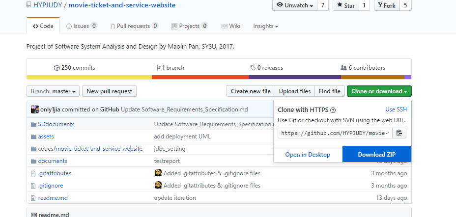
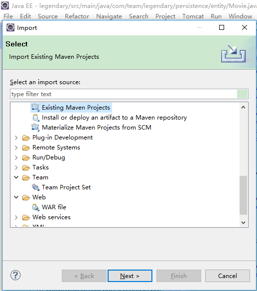
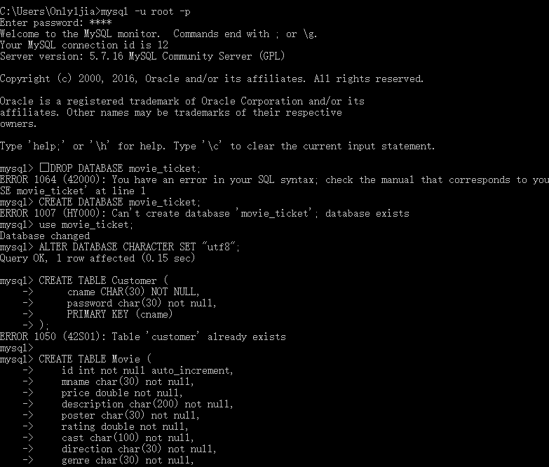
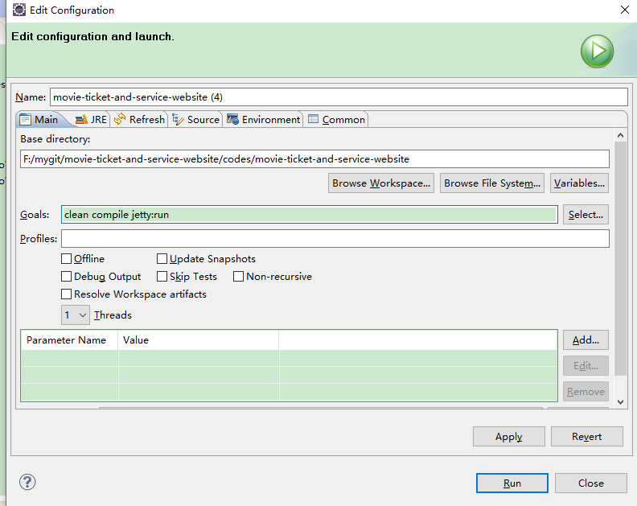
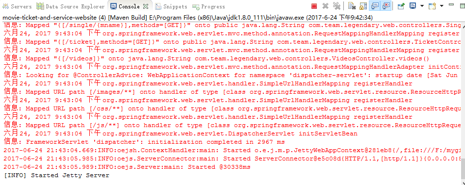
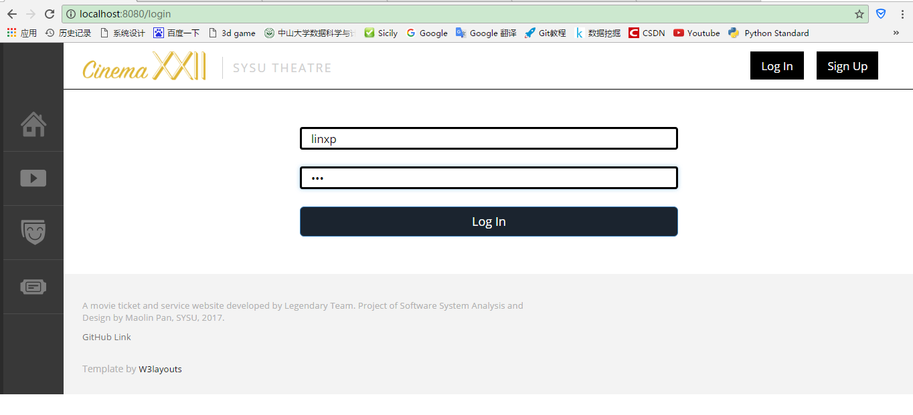
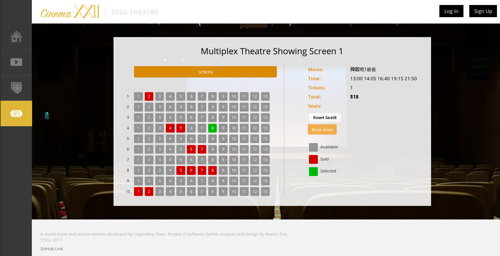
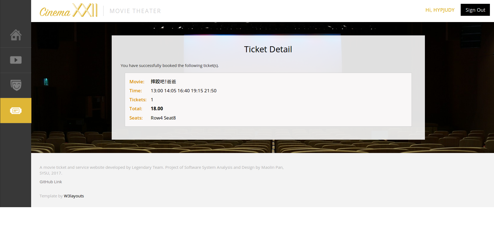

# 用户手册
## 1.引言
### 1.1编写目的
本文档编写的目的是充分叙述本软件所能实现的的功能及其运行环境，以便使用者了解本软件的使用范围和使用方法，并为软件的接下来的开发提供必要的信息

## 2.软件概述
### 2.1 软件用途
本软件的开发是为用户提供一个网上在线查询最新电影，购买电影票的工具。
### 2.2 软件运行
本软件可以运行在PC机及其兼容机上，支持Linux、Window操作系统，但需要先配置好安装环境 java+maven+mysql
### 2.3 安装部署配置
参照文档Deployment Instrction进行相应操作

## 3 软件使用过程
### 3.1 运行步骤

直接从网址https://github.com/HYPJUDY/movie-ticket-and-service-website.git 下载安装包

解压后通过Eclipse Import Maven Project导入该项目

登陆mysql，使用mysql_ddl.sql建立起数据库

通过maven bulid并使用jetty服务器编译运行该项目

### 3.2 运行界面

### 3.3 操作信息
网站首页可以查看最新电影资讯，电影预告片，用户登陆后即可对喜欢的电影进行选座购票

## 4.用户操作举例
用户注册登陆

观看电影预告片(注:需翻墙才能正常观看)

电影票售票界面

点击BOOK NOW进如下单界面(需要先登录)
选好座位后点击Book Now！开始下单

订单成功后

点击logout返回首页界面

