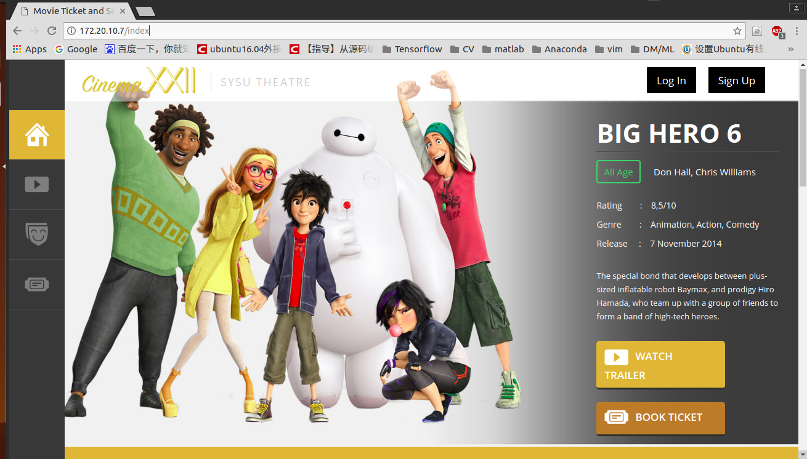

Code of movie-ticket-and-service-website.

For developers: 
* 请在 `How to Run All` 为用户尽可能详细地描述运行流程。（相当于写部署说明/安装手册/用户手册）。
* 请在`Implementation`尽可能详细地描述实现内容及方法。
* 请在`Reference`记录参考资料。

# How to Run All
1. Download `movie-ticket-and-service-website` repository.
2. Download and config MySQL Server. For example, you can refer to [MySQL5.7.11 免安装版配置（WIN 64bit）](http://blog.csdn.net/zhangmingbao2016/article/details/51035214) for Windows system. Now you should have successfully started sql by using command `net start MySQL` in cmd (better to run as administrator>.
3. Note that in `/movie-ticket-and-service-website/src/main/webapp/WEB-INF/applicationContext.xml`, the default username and password are set as follow:
    
``` xml
<property name="username" value="root" />
<property name="password" value="root" />
```
    
   You can change the password value to one of your MySQL root user's passwords. Or config the default password in MySQL:
   * Log in as root user: `mysql -u root -p`. The default password is empty (directly press `Enter` key).
   * Change the password to `root`: `mysql> set password for root@localhost = password('root');`
   Attention: Between line 18-22, comment/uncomment lines according to your system.
4. Create database (`mysql> CREATE DATABASE movie_ticket;`) and use database (`mysql> use movie_ticket;`).
5. Create tables and insert some values by copy all contents in `/movie-ticket-and-service-website/src/main/resources/mysql_ddl.sql` to `mysql>` command line. (If you have error in chinese characters decoding, plese refer to [Convert to UTF-8](https://stackoverflow.com/questions/6115612/how-to-convert-an-entire-mysql-database-characterset-and-collation-to-utf-8))
6. Run `movie-ticket-and-service-website` application in Eclipse.
    * Import the project (path: `movie-ticket-and-service-website/codes/movie-ticket-and-service-website/`) to Eclipse.
    * Run -> Run as -> Maven build... -> Goals:"clean compile jetty:run"
7. Visit `http://localhost:8080/login.html` in your browser to log in. The VIP customer (which is set in `mysql_ddl.sql`) is `"linxp", "password"`. You can directly log in as `linxp`.
8. Visit `http://localhost:8080/signup.html` in your browser to sign up. Remember the usename and password you set and then try to log in.

# Implementation
## Iteration 1: Front End
Yupan Huang, 2017/5/22


For more details, please read [this post](https://hypjudy.github.io/2017/05/30/spring-boot-web-application/).

### Tech
Building a Spring Boot Web Application. Focus on front end.
* Spring
* Spring MVC for the web part (without database currently)
* Thymeleaf for the template engine
* Tomcat server

### How to run
* [JDK 1.8](http://www.oracle.com/technetwork/java/javase/downloads/index.html) or later
* [Maven 3.0+](https://maven.apache.org/download.cgi) or [Gradle 2.3+](http://www.gradle.org/downloads)
* Import the code straight into your IDE:
    - [IntelliJ IDEA](https://spring.io/guides/gs/intellij-idea/)
    - Eclipse (Run as -> Maven build... -> Goals:"jetty:run")

### Approach
1. Initialize a Spring Boot project with IntelliJ. Be sure to check "Web" and "Thymeleaf". (Please refer to [2: Part 1])
2. Download web templates [3] and [4].
3. Serving web content with Spring MVC -- write htmls and controllers (no database now). Also need to combine two web templates. (Please refer to [1] and [2: Part 2&4])
4. Including Thymeleaf fragments to make code neat and compact. (Please refer to [2: Part 4])

### Update
#### Log in & Sign up
Yupan Huang, 2017/5/28

Add log in/sign up buttons and pages. Remove Contact button and page.


2017/5/20

Navigate to index page after logging in.
Navigate to login page after signing up.

Reference: [Handling Form Submission](https://spring.io/guides/gs/handling-form-submission/)

## Iteration 2: Database and authorization
Xipeng Lin, 2017/5/29

### Work
Implement the authorization of the application and build database connected with jdbc.

Implement the login and register function completely.

### What to do before running
* create database named "movie_ticket" in mysql
* create some essential tables with the sql statements in file "mysql_ddl.sql"
* change the password in file "applicationContext.xml" into the one of your mysql root user

### Update movie class and order class
What to do before running
* drop the previous movie and ordertable tables in your mysql database with the command `drop table movie;` and `drop table ordertable;`
* create new tables with the SQL statement in the updated .sql file.

## Rename some property of the tabels in our database
* Change to lowercase letters only

# Reference
1. [Serving Web Content with Spring MVC](https://spring.io/guides/gs/serving-web-content/)
2. Tutorial series -- SPRING BOOT WEB APPLICATION: [PART 1 - Spring Initializer](https://springframework.guru/spring-boot-web-application-part-1-spring-initializr/), [PART 2 - Using Thymeleaf](https://springframework.guru/spring-boot-web-application-part-2-using-thymeleaf/), [PART 3 - Spring Data JPA](https://springframework.guru/spring-boot-web-application-part-3-spring-data-jpa/), [PART 4 - Spring MVC](https://springframework.guru/spring-boot-web-application-part-4-spring-mvc/) and [PART 5 - Spring Security](https://springframework.guru/spring-boot-web-application-part-5-spring-security/).
3. [Cinema a Entertainment Category Flat Bootstrap Responsive Web Template](https://w3layouts.com/cinema-a-entertainment-category-flat-bootstrap-responsive-web-template/)
4. [Movie Ticket Booking Widget Flat Responsive Widget Template](https://w3layouts.com/movie-ticket-booking-widget-flat-responsive-widget-template/)

## Iteration 3: Nginx
Fuyu Wang, 2017/6/10

### How to start nginx
1. Install, configure, and configure, following the blogs below.
2. Start nginx by command "./nginx"
3. My ip is "172.20.10.7", by Browser without inputing port, we can get:


# Reference
1. [Install and Deploy] (http://www.nginx.cn/install)
2. [Configure] (http://www.ha97.com/5194.html)
3. [Sticky] (https://bitbucket.org/nginx-goodies/nginx-sticky-module-ng/overview)
