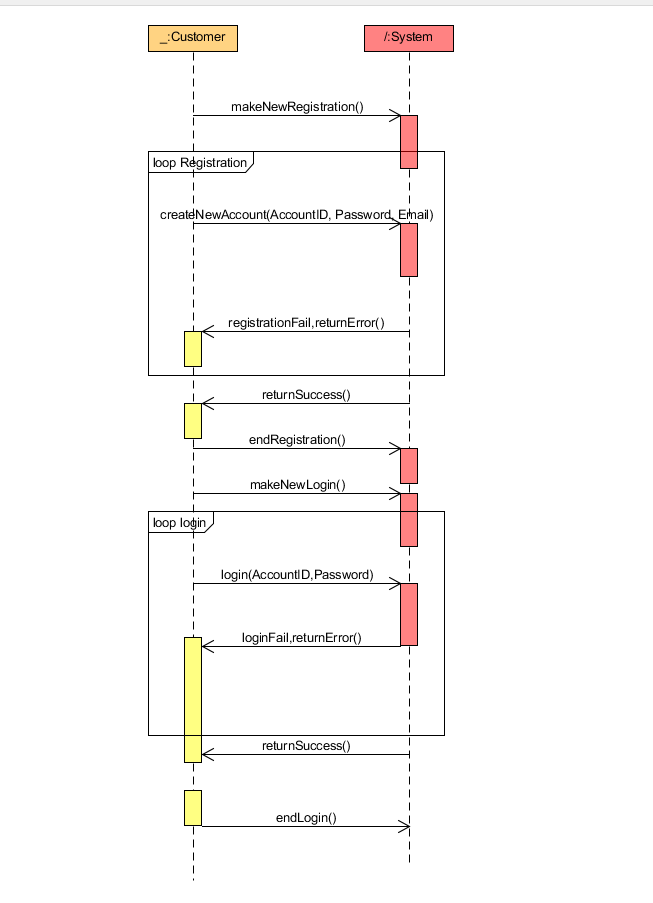

非正式文档，至少包含3个用例主场景的系统顺序图，5个操作契约的后置条件
##用例主场景一：用户注册和登录

##用例主场景二：用户订票

##用例主场景二：用户退票

##操作契约如下：
 - 契约一：createNewAccount
操作：createNewAccount(AccountID:string, Password:string, Email:string)；
交叉引用：用例：用户注册账号
前置条件：用户正在注册账号
后置条件：创建了一个新账号，将该账号信息写入系统数据库中。

 - 契约二：login
操作：login(AccountID:string,Password:string)；
交叉引用：用例：用户登录
前置条件：用户正在登录账号
后置条件：系统创建一个线程管理用户的操作。

 - 契约三：enterReservation
操作：enterReservation(movie:String,cinema:String,seat:int,time:int)；
交叉引用：用例：用户预定电影票
前置条件：用户正在预定电影票
后置条件：系统创建一个订单信息数据，将该订单信息写入系统数据中，并且将处理后的信息返回给客户用于确认订单。

 - 契约四：confirmReservation
操作：confirmReservation(confirmResult:boolean)；
交叉引用：用例：用户确认电影票订单
前置条件：用户正在确认订单
后置条件：系统确认订单并且在数据库中将该订单状态改为已确认。

 - 契约五：requireRefund
操作：requireRefund(reservationID:int)；
交叉引用：用例：用户退款
前置条件：用户正在请求退款
后置条件：系统在经过审核通过之后，通过reservationID在该用户的数据库中找到该订单并且删除该订单相关信息。
