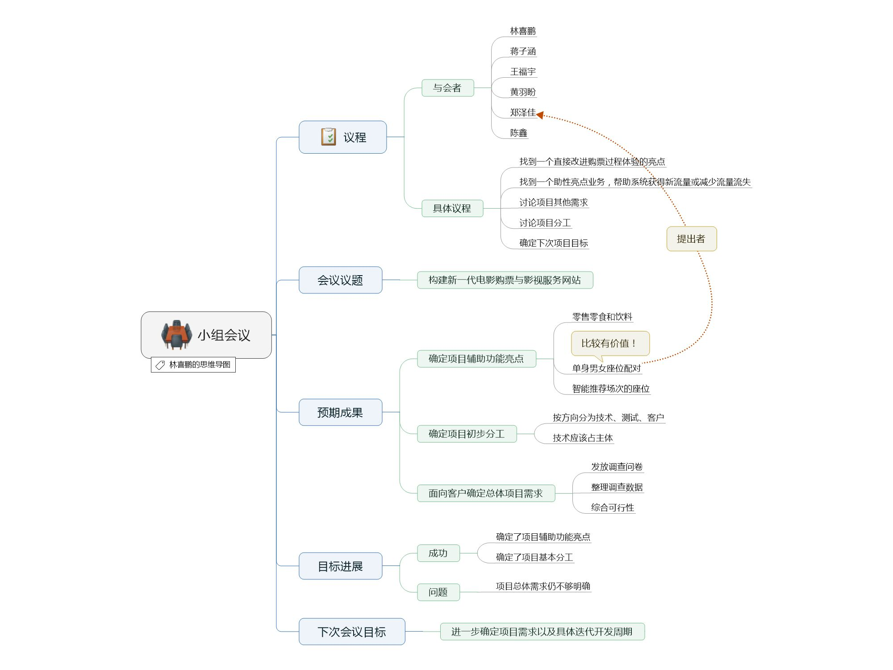
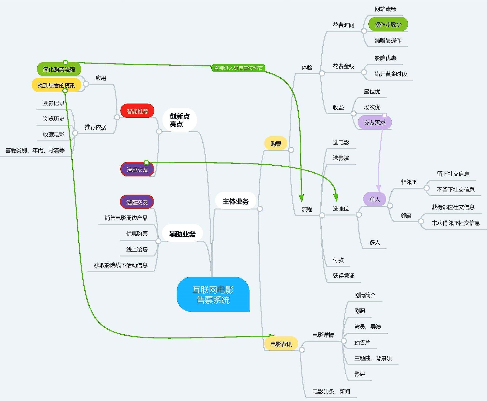
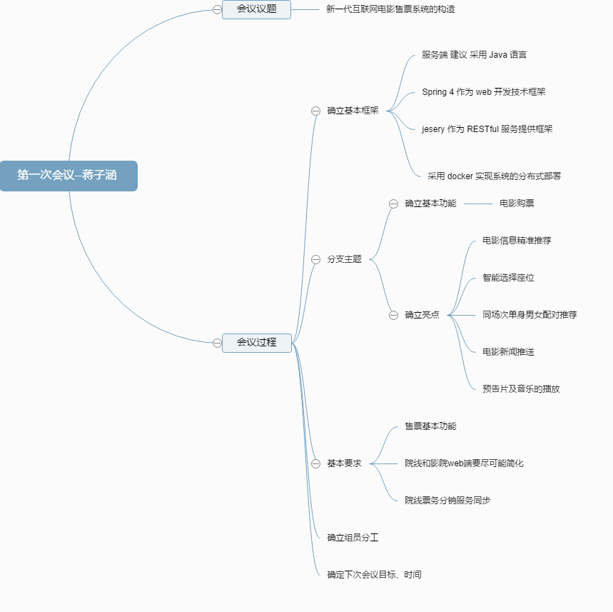

# 项目启动及第一次会议纪要
## “构建新一代电影购票与影视服务网站”研讨会
2017.3.17 10:00-11:00
- 会议目标：
    + 找到一个直接改进购票过程体验的亮点：快速选座（根据历史习惯等预测影片、锁定影院、推荐座位，力求跳过重复的中间步骤，直接为用户推荐座位购票）
    + 找到一个辅助性亮点业务，帮助系统获得新流量或减少流量流失：智能选座（包括交友配对）
- 个人任务：自己记录会议“思维导图”拍照，作为你项目技术报告的一部分。请在现场，使用 “思维导图” 导图记录目标达成的过程。 用重点标识符勾出你认为（贡献人含自己）最有价值的要点与冲突。（肯定别人提议，凝练议题要点，群面必杀之技）。
- 创新点凝练：智能推荐、选座交友

## 记录会议“思维导图”
（最后验收时再整理在个人技术报告中）
*credit: lxp*
*credit: hyp*
*credit: jzh*
*credit: cx*
