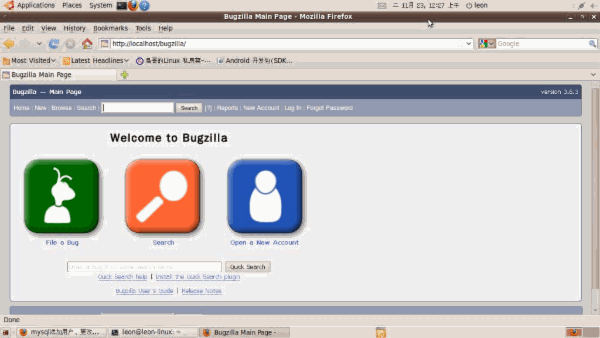

<h3>Git</h3>

<h4>在Linux上安装Git</h4>

首先，你可以试着输入git，看看系统有没有安装Git：

$ git
The program 'git' is currently not installed. You can install it by typing:
sudo apt-get install git
像上面的命令，有很多Linux会友好地告诉你Git没有安装，还会告诉你如何安装Git。

如果你碰巧用Debian或Ubuntu Linux，通过一条sudo apt-get install git就可以直接完成Git的安装，非常简单。

安装完成后，还需要最后一步设置，在命令行输入：

$ git config --global user.name "Your Name"
$ git config --global user.email "email@example.com"
因为Git是分布式版本控制系统，所以，每个机器都必须自报家门：你的名字和Email地址。你也许会担心，如果有人故意冒充别人怎么办？这个不必担心，首先我们相信大家都是善良无知的群众，其次，真的有冒充的也是有办法可查的。

注意git config命令的--global参数，用了这个参数，表示你这台机器上所有的Git仓库都会使用这个配置，当然也可以对某个仓库指定不同的用户名和Email地址。

<h4>创建版本库</h4>

版本库又名仓库，英文名repository，你可以简单理解成一个目录，这个目录里面的所有文件都可以被Git管理起来，每个文件的修改、删除，Git都能跟踪，以便任何时刻都可以追踪历史，或者在将来某个时刻可以“还原”。

所以，创建一个版本库非常简单，首先，选择一个合适的地方，创建一个空目录：

$ mkdir learngit
$ cd learngit
$ pwd
/Users/michael/learngit
pwd命令用于显示当前目录。在我的Mac上，这个仓库位于/Users/michael/learngit。

如果你使用Windows系统，为了避免遇到各种莫名其妙的问题，请确保目录名（包括父目录）不包含中文。

第二步，通过git init命令把这个目录变成Git可以管理的仓库：

$ git init
Initialized empty Git repository in /Users/michael/learngit/.git/

初始化一个Git仓库，使用git init命令。

添加文件到Git仓库，分两步：

第一步，使用命令git add <file>，注意，可反复多次使用，添加多个文件；

第二步，使用命令git commit，完成。

<h4>Git远程操作详解</h4>

git clone

git remote

git fetch

git pull

git push

<h5>git clone</h5>

远程操作的第一步，通常是从远程主机克隆一个版本库，这时就要用到git clone命令。

$ git clone <版本库的网址>

比如，克隆jQuery的版本库。

$ git clone https://github.com/jquery/jquery.git

该命令会在本地主机生成一个目录，与远程主机的版本库同名。如果要指定不同的目录名，可以将目录名作为git clone命令的第二个参数。

$ git clone <版本库的网址> <本地目录名>

git clone支持多种协议，除了HTTP(s)以外，还支持SSH、Git、本地文件协议等

<h5>git remote</h5>

为了便于管理，Git要求每个远程主机都必须指定一个主机名。git remote命令就用于管理主机名。
不带选项的时候，git remote命令列出所有远程主机。

$ git remote
origin
使用-v选项，可以参看远程主机的网址。

$ git remote -v
origin  git@github.com:jquery/jquery.git (fetch)
origin  git@github.com:jquery/jquery.git (push)
上面命令表示，当前只有一台远程主机，叫做origin，以及它的网址。
克隆版本库的时候，所使用的远程主机自动被Git命名为origin。如果想用其他的主机名，需要用git clone命令的-o选项指定。

$ git clone -o jQuery https://github.com/jquery/jquery.git
$ git remote
jQuery
上面命令表示，克隆的时候，指定远程主机叫做jQuery。
git remote show命令加上主机名，可以查看该主机的详细信息。

$ git remote show <主机名>
git remote add命令用于添加远程主机。

$ git remote add <主机名> <网址>
git remote rm命令用于删除远程主机。

$ git remote rm <主机名>
git remote rename命令用于远程主机的改名。

$ git remote rename <原主机名> <新主机名>

<h5>git fetch</h5>

一旦远程主机的版本库有了更新（Git术语叫做commit），需要将这些更新取回本地，这时就要用到git fetch命令。

$ git fetch <远程主机名>
上面命令将某个远程主机的更新，全部取回本地。
git fetch命令通常用来查看其他人的进程，因为它取回的代码对你本地的开发代码没有影响。
默认情况下，git fetch取回所有分支（branch）的更新。如果只想取回特定分支的更新，可以指定分支名。

$ git fetch <远程主机名> <分支名>
比如，取回origin主机的master分支。

$ git fetch origin master
所取回的更新，在本地主机上要用"远程主机名/分支名"的形式读取。比如origin主机的master，就要用origin/master读取。
git branch命令的-r选项，可以用来查看远程分支，-a选项查看所有分支。

$ git branch -r
origin/master

$ git branch -a
* master
  remotes/origin/master
上面命令表示，本地主机的当前分支是master，远程分支是origin/master。
取回远程主机的更新以后，可以在它的基础上，使用git checkout命令创建一个新的分支。

$ git checkout -b newBrach origin/master
上面命令表示，在origin/master的基础上，创建一个新分支。
此外，也可以使用git merge命令或者git rebase命令，在本地分支上合并远程分支。

$ git merge origin/master
或者
$ git rebase origin/master
上面命令表示在当前分支上，合并origin/master。

<h5>git pull</h5>
git pull命令的作用是，取回远程主机某个分支的更新，再与本地的指定分支合并。它的完整格式稍稍有点复杂。

$ git pull <远程主机名> <远程分支名>:<本地分支名>
比如，取回origin主机的next分支，与本地的master分支合并，需要写成下面这样。

$ git pull origin next:master
如果远程分支是与当前分支合并，则冒号后面的部分可以省略。

$ git pull origin next
上面命令表示，取回origin/next分支，再与当前分支合并。实质上，这等同于先做git fetch，再做git merge。

$ git fetch origin
$ git merge origin/next
在某些场合，Git会自动在本地分支与远程分支之间，建立一种追踪关系（tracking）。比如，在git clone的时候，所有本地分支默认与远程主机的同名分支，建立追踪关系，也就是说，本地的master分支自动"追踪"origin/master分支。
Git也允许手动建立追踪关系。

git branch --set-upstream master origin/next
上面命令指定master分支追踪origin/next分支。
如果当前分支与远程分支存在追踪关系，git pull就可以省略远程分支名。

$ git pull origin
上面命令表示，本地的当前分支自动与对应的origin主机"追踪分支"（remote-tracking branch）进行合并。
如果当前分支只有一个追踪分支，连远程主机名都可以省略。

$ git pull
上面命令表示，当前分支自动与唯一一个追踪分支进行合并。
如果合并需要采用rebase模式，可以使用--rebase选项。

$ git pull --rebase <远程主机名> <远程分支名>:<本地分支名>
如果远程主机删除了某个分支，默认情况下，git pull 不会在拉取远程分支的时候，删除对应的本地分支。这是为了防止，由于其他人操作了远程主机，导致git pull不知不觉删除了本地分支。
但是，你可以改变这个行为，加上参数 -p 就会在本地删除远程已经删除的分支。

$ git pull -p

等同于下面的命令

$ git fetch --prune origin 
$ git fetch -p

<h5>git push</h5>
git push命令用于将本地分支的更新，推送到远程主机。它的格式与git pull命令相仿。

$ git push <远程主机名> <本地分支名>:<远程分支名>
注意，分支推送顺序的写法是<来源地>:<目的地>，所以git pull是<远程分支>:<本地分支>，而git push是<本地分支>:<远程分支>。
如果省略远程分支名，则表示将本地分支推送与之存在"追踪关系"的远程分支（通常两者同名），如果该远程分支不存在，则会被新建。

$ git push origin master
上面命令表示，将本地的master分支推送到origin主机的master分支。如果后者不存在，则会被新建。
如果省略本地分支名，则表示删除指定的远程分支，因为这等同于推送一个空的本地分支到远程分支。

$ git push origin :master

等同于

$ git push origin --delete master
上面命令表示删除origin主机的master分支。
如果当前分支与远程分支之间存在追踪关系，则本地分支和远程分支都可以省略。

$ git push origin
上面命令表示，将当前分支推送到origin主机的对应分支。
如果当前分支只有一个追踪分支，那么主机名都可以省略。

$ git push
如果当前分支与多个主机存在追踪关系，则可以使用-u选项指定一个默认主机，这样后面就可以不加任何参数使用git push。

$ git push -u origin master
上面命令将本地的master分支推送到origin主机，同时指定origin为默认主机，后面就可以不加任何参数使用git push了。
不带任何参数的git push，默认只推送当前分支，这叫做simple方式。此外，还有一种matching方式，会推送所有有对应的远程分支的本地分支。Git 2.0版本之前，默认采用matching方法，现在改为默认采用simple方式。如果要修改这个设置，可以采用git config命令。

$ git config --global push.default matching

或者

$ git config --global push.default simple
还有一种情况，就是不管是否存在对应的远程分支，将本地的所有分支都推送到远程主机，这时需要使用--all选项。

$ git push --all origin
上面命令表示，将所有本地分支都推送到origin主机。
如果远程主机的版本比本地版本更新，推送时Git会报错，要求先在本地做git pull合并差异，然后再推送到远程主机。这时，如果你一定要推送，可以使用--force选项。

$ git push --force origin 
上面命令使用--force选项，结果导致远程主机上更新的版本被覆盖。除非你很确定要这样做，否则应该尽量避免使用--force选项。
最后，git push不会推送标签（tag），除非使用--tags选项。

$ git push origin --tag

<h3>Bugzilla</h3>

<h4>下载bugzilla源码</h4>
http://ftp.mozilla.org/pub/mozilla.org/webtools/bugzilla-3.6.2.tar.gz，可以选择安装中文版，但是目前只支持到3.4.3(http://code.google.com/p/bugzilla-cn/)

sudo wget http://ftp.mozilla.org/pub/mozilla.org/webtools/bugzilla-3.6.2.tar.gz

解压 sudo tar zxvf bugzilla-3.6.2.tar.gz

<h4>按照安装向导中说明,需要预先安装一下几个软件</h4>

Perl(V5.8.1以上)

数据库引擎(Mysql/postgresql/Oracle)

Web服务器

Perl Moudles(Perl 模块)

Mail Transfer Agent

<h4>Perl一般是系统自带 ，如果没有或者版本不符合要求，请自行安装，或者apt-get install
用Perl -v查看perl版本信息</h4>

<h4>安装数据库引擎MySQL</h4>
安装教程这里不再详述
  
<h4>安装web服务器</h4>

下载httpd-2.2.16

tar zxvf httpd-2.2.16.tar.gz

cd httpd-2.2.16

 sudo ./configure --prefix=/usr/local/apache

 sudo make

sudo make install

sudo groupadd apache

sudo useradd -g apache apache

自启动

sudo cp /usr/local/apache/bin/apachectl /etc/init.d/apache

chmod +x /etc/init.d/apache

chkconfig --add apache

<h4>安装perl模块</h4>

cd **/bugzilla-3.6.2

./checksetup.pl --check-modules

查看要运行bugzilla需要的必须perl模块或者可选模块，如果显示为红色表示没有找到not found。它会提示使用什么命令进行安装
使用perl install-module.pl --all命令安装所有not found的perl 模块 

当然也存在一些安装不上的情况，这时要自己安装，我安装时候存在dbd::mysql，和mod-perl2 安装不成功，到cpan上下载需要的模块安装
安装dbd::mysql 

sudo perl Makefile.PL --mysql_config=/app/mysql/bin/mysql_config --with-mysql=/app/mysql

报错Argument "6.55_02" isn't numeric in numeric ge (>=) at Makefile.PL line 350, <PIPE> line 102.
Unrecognized argument in LIBS ignored: '-rdynamic'

Using DBI 1.614 (for perl 5.010001 on i486-Linux-gnu-thread-multi) installed in /usr/local/lib/perl/5.10.1/auto/DBI/Writing Makefile for DBD::mysql
但是sudo make test ,make ,make install 成功安装

安装mod-perl2 wget http://perl.apache.org/dist/mod_perl-2.0.4.tar.gz

tar zxvf mod_perl-2.0.4.tar.gz

d mod_perl-2.0.4

动态安装过程，先安装好apache再安装mod_perl

perl Makefile.PL MP_APXS=/path/to/apxs

make 

报错：/usr/bin/ld: cannot find -lperl 解决方法sudo apt-get install libperl-dev  

make && make install

详细过程可以参见http://perl.apache.org/docs/2.0/user/install/install.html 

<h4>Mail Transfer Agent安装</h4>

sudo apt-get install postfix 

配置一下即可使用

如果想详细了解postfix可以参考http://wiki.ubuntu.org.cn/UbuntuHelp:Postfix/zh安装方法。

<h4>配置</h4> 

本安装中使用mysql作为bugzilla数据库，首先需要建立database 

mysql -u root -p

create database bugs;

**_建立用户_**

mysql> GRANT SELECT, INSERT,

UPDATE, DELETE, INDEX, ALTER, CREATE, LOCK TABLES,

CREATE TEMPORARY TABLES, DROP, REFERENCES ON bugs.*

TO bugs@localhost IDENTIFIED BY 'password';

mysql> FLUSH PRIVILEGES;

配置httpd.conf 

**_添加_**

<Directory /var/www/html/bugzilla>

AddHandler cgi-script .cgi

Options +Indexes +ExecCGI

DirectoryIndex index.cgi

AllowOverride Limit

</Directory>

LoadModule perl_module modules/mod_perl.so

**_创建bugzilla数据库表_**

cd **/bugzilla-3.6.2
./checksetup.pl会生成localconfig，修改$db_driver='mysql'/'Pg'/'Oracle',$db_host='localhost'

(或者主机的ip地址),$db_name = 'bugs';$db_user = 'bugs';$db_pass = 'password';$db_port = 3306;$webservergroup = 'apache'

(因为在第5步安装web服务器时建立了group，所以这里使用建立的apache)保存之后再一次执行./checksetup.pl这次会根据localconfig文件生成相应数据库表
根据提示可以知道是成功执行与否，如果执行成功之后执行操作

mysql> use $bugs_db

mysql> ALTER TABLE attachments
AVG_ROW_LENGTH=1000000, MAX_ROWS=20000;(目的是允许附件表增长超过4gb)

<h4>sudo cp -r **/bugzilla **/apache/htdocs/bugzilla</h4> 

完成以上所有过程bugzilla安装完成，运行http://localhost/bugzilla显示界面

