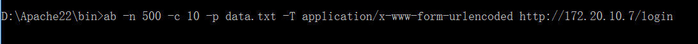
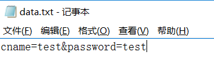
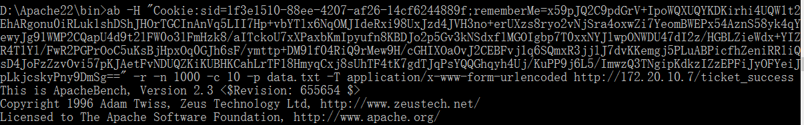
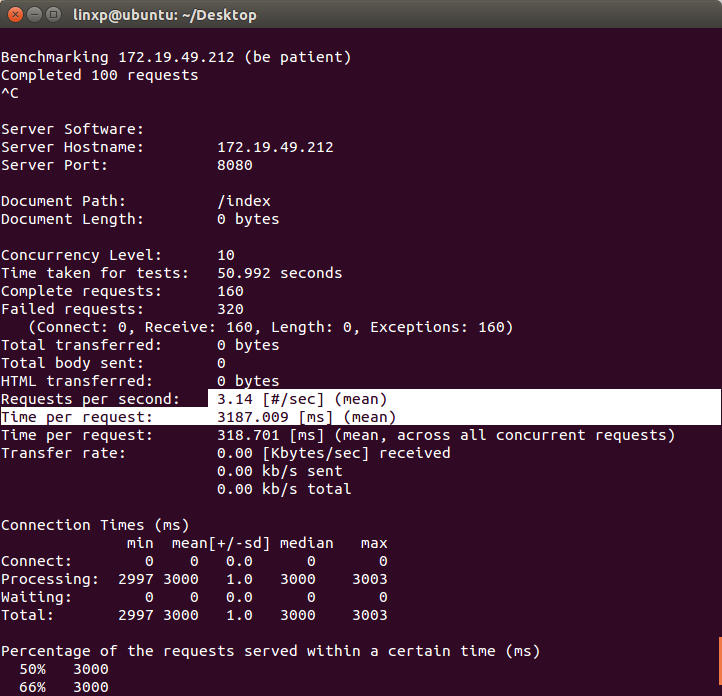
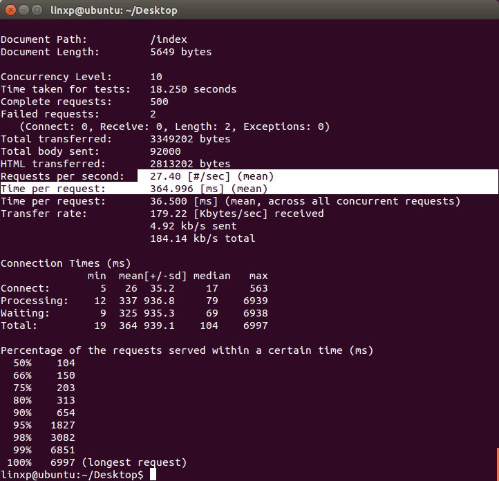
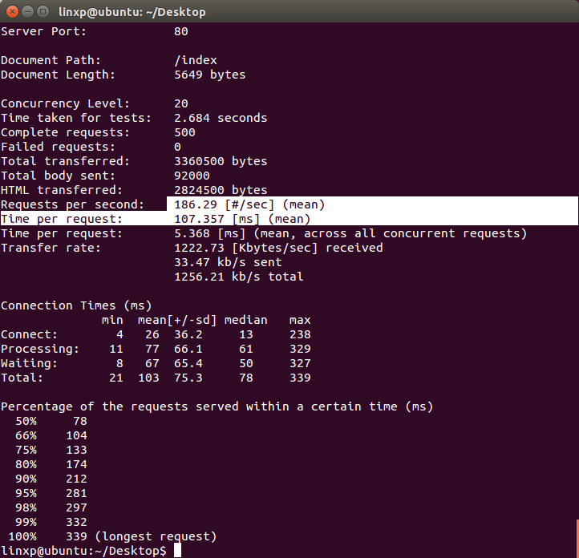

## TestReport
#1.测试环境：SYSU-SECURE

#2.测试各服务器的IP
主服务器：172.20.10.7
从服务器：172.20.10.3
测试机：172.20.10.6

#3.测试命令
1）测试命令：
登录：

其中，data.txt文件里为：

订票：

其中，data.txt文件里为：

2）测试结果：
<1>未开启负载均衡（Nginx）的单服务器测试结果：

从图中可以看出，并发数为10（增大也差不多）时，每秒的支持的请求数平均为3.14，每个请求的处理时间平均为3187ms（98%的请求都接近3000ms）；
<2>使用负载均衡后测试结果：

可以看出，这里每秒平均支持的请求数已经达到27.4，每个登录请求的平均时间为366.9ms；继续增大并发数（并发数为20时,基本达到了最大值），性能有了极大的提高。

可以看到，这里每秒支持的登录请求数已经达到了186.29，每个请求的处理时间平均为107.357，性能有了极大的提高；
<3>测试后数据库变化如下：

用户信息如下：

